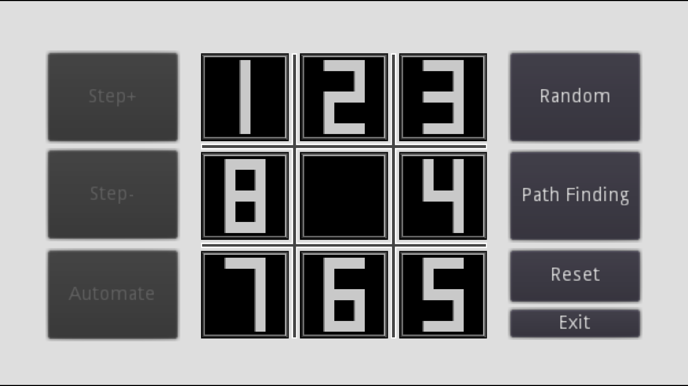

# 8 Puzzle Godot

an 8 puzzle game with an ability to solve 8-puzzle-problem up to 20 Vertical-Horizontal move of no-number-plate(the plate with no number on it).\
Here I used [DFS](https://en.wikipedia.org/wiki/Depth-first_search) (Deep first Search) algorithm to find a solution but not always the best solution, (because of the DFS method that will not find the most optimal solution).

## Game Scene

Note: do not use **Random** button and next **Path Finding** and then expect the algorithm to find a solution.\
This is not gonna happen because most of the times, Random button will mess up the whole scene and the generated problem is not solvable at all but cause you can move **Diagonal**, you can solve it by yourself and it is fun.

## How To Play

Mess up the scene with vertical and horizontal moves around **no number black square**. (maximum **20** moves, not more than that)\
Then press **Path Finding** button and wait.\
If algorithm finishes solving the problem, will show a congratulation  and left side buttons are accessible after that, If not, you just lost a long time till the algorithm finishes with no answer.\
You can use **Step+** to move forward to solving and **Step-** to backward the solving or **Automate** to see the solving steps automatically.